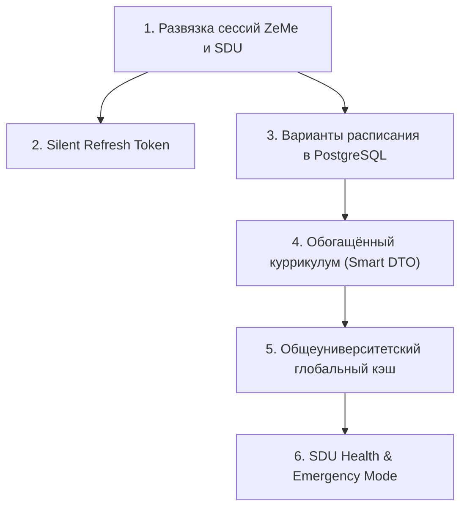

# 🏛️ ПОЛНЫЙ КОНТЕКСТ РЕФАКТОРИНГА ZEME (ДЛЯ НОВОГО ЧАТА)

> **Инструкция для нового диалога:** скопируйте этот документ и отправьте в первом сообщении нового чата. В нём собрана вся предыстория, анализ архитектуры, сделанная работа, точная точка остановки и детальный план оставшихся шагов.

---

## 1. 📌 Предыстория и корневая причина багов (Root Cause)

### Что происходило в продакшене (`https://ai-advisor-olive.vercel.app`):
1. **Поиск курса `CSS 483`**: приводил к сетевой ошибке:
   `SDU ajx ShowAvailableAllSections: HTTP 302` (портал SDU редиректил запрос на `loginAuth.php`).
2. **Поиск курса `CSS 410`**: приводил к ошибке:
   `SDU ajx ShowAvailableAllSections: неожиданный ответ (#!3%6$#@458#!2*/-&2@...)`.
3. **Клик по кнопке "Choose" на предмете `CSS 410` в куррикулуме**: приводил к той же ошибке `#!3%6$#@458...`, интерфейс падал и **не прокидывал пользователя на экран выбора секций и расписания**.

### Корневая причина (Root Cause Analysis):
* **Особенность портала SDU (`my.sdu.edu.kz`)**: портал работает на связке Apache + PHP. Сессия портала (`PHPSESSID`) имеет жесткий таймаут неактивности **15–20 минут**.
* Когда сессия `PHPSESSID` протухает, портал SDU на AJAX-запросы (`index.php?ajx=1`) возвращает:
  * либо `HTTP 302` с заголовком `Location: loginAuth.php` (или `verification.php`),
  * либо `HTTP 200` с сырым внутренним маркером неавторизованного AJAX: `#!3%6$#@458#!2*/-&2@`.
* **Архитектурные дефекты старой версии ZeMe**:
  1. **Связанность сессий:** Сессия ZeMe была намертво склеена с сессией SDU. Как только протухал `PHPSESSID`, ZeMe считал пользователя неавторизованным, стирал сессию, выкидывал на логин и уничтожал несохраненный драфт расписания.
  2. **Избыточные сетевые вызовы:** При каждом запросе секций курса (`/api/sections?code=CSS 410`) сервер ZeMe повторно парсил весь тяжелый куррикулум программы через SDU, чтобы найти `progCode` и `progYear`, вместо использования предвычисленных параметров.
  3. **Локальный план:** Расписание (`plan`) сохранялось только в `localStorage` браузера и не синхронизировалось между устройствами.

---

## 2. 🔍 Анализ референса (`sdu.javazhan.tech`) и инфраструктура

Был проведён глубокий реверс-инжиниринг платформы `https://sdu.javazhan.tech` (тестовый студент: логин `240103199`, пароль `5652565pP))))`):
* **Архитектура сессий**: Сессия приложения полностью развязана с сессией SDU. Студент авторизован в приложении бессрочно (Refresh Token), а к SDU приложение обращается в фоне. Если SDU протух, приложение не выкидывает студента, а показывает компактный ввод пароля при необходимости живого запроса.
* **Каталог курсов и секций**: Закеширован на сервере. Секции отдаются мгновенно за ~10 мс.
* **Smart DTO / HATEOAS**: Куррикулум приходит с готовым объектом `sections_action` — фронтенду не нужно знать структуру программ, он просто делает прямой вызов.
* **Многовариантность**: Студент может создавать несколько вариантов расписания («Основной», «Без пятницы», «Утренний»), которые хранятся на сервере.

### Инфраструктурные ограничения (Free Tier):
* **База данных:** Neon PostgreSQL (Free Tier: 500 МБ хранилища, 190 compute-часов/мес, Connection Pooling до 10 000 соединений).
* **Хватит ли бесплатного Neon на 10 000 студентов?**
  * В SDU всего ~1 000 курсов. Размер секций одного курса в JSON: ~10 КБ.
  * Весь каталог курсов университета занимает **всего ~10 МБ!**
  * Даже с вариантами расписаний 10 000 студентов база займет не более 50–70 МБ из 500 МБ доступных.
* **Нужен ли платный Redis?**
  * **Нет.** PostgreSQL с индексами по ключам отдает записи за 5–15 мс. Redis не требуется.

---

## 3. 🗺️ Полный список 6 архитектурных задач рефакторинга



1. **Задача 1: Развязка сессий ZeMe и SDU Portal + Graceful Degradation**
   * Смерть сессии SDU не уничтожает сессию ZeMe.
   * Ошибки протухания сессии SDU перехватываются и вызывают компактную модалку `SduReconnectModal` без потери драфта.
2. **Задача 2: Бесшовное автопродление сессии ZeMe (Silent Refresh Interceptor)**
   * Механизм Sliding Session в базе данных.
   * Фронтенд-интерцептор с Promise Mutex автоматически обновляет токен при 401 и повторяет запросы без перезагрузки страницы.
3. **Задача 3: Сохранение вариантов расписания на сервере (`/api/schedule/variants`)**
   * Таблица `schedule_variants` в Neon PostgreSQL.
   * Полный REST API CRUD (GET, POST, PUT, DELETE, PUT active).
   * Компонент `ScheduleVariantsPanel` с вкладками, переименованием, удалением и автосинхронизацией (debounce 400 мс).
4. **Задача 4: Обогащённый куррикулум с готовыми `sections_action` (Smart DTO)**
   * Эндпоинт `/api/curriculum` возвращает каждый курс с готовыми параметрами перехода (`sections_action`: `{ endpoint, params: { code, pc, py, track, mufSqId } }`).
   * `/api/sections` принимает параметры напрямую и не парсит куррикулум заново при каждом запросе.
5. **Задача 5: Общеуниверситетский глобальный кэш секций с фоновым обновлением (Stale-While-Revalidate)**
   * Секции, загруженные одним студентом, мгновенно становятся доступны всем остальным.
   * При падении портала SDU отдаются устаревшие данные из базы (`_stale: true`).
6. **Задача 6: Мониторинг здоровья SDU и Emergency Mode (`/api/system/status`)**
   * Фоновый мониторинг пинга и доступности `my.sdu.edu.kz`.
   * Баннер в интерфейсе при сбоях портала («Портал SDU недоступен, работаем автономно из кэша»).

---

## 4. ✅ Что УЖЕ сделано и задеплоено

### Шаг 1 (Завершен и задеплоен, коммит `55fbd8e`):
* `server/db.mjs`: добавлено поле `sdu_active BOOLEAN DEFAULT true` в таблицу `sessions`.
* `server/session.mjs`: методы `createSession`, `getSession`, `updateSession`, `setSduActive`.
* `server/cache.mjs`: увеличен TTL кэша до 6 часов, добавлен `getStaleCachedSections()` для аварийного фолбэка.
* `server/index.mjs`:
  * Централизованный обработчик ошибок: при падении SDU помечает `sdu_active = false`, но сохраняет сессию пользователя.
  * Добавлены эндпоинты `POST /api/auth/sdu-reconnect` и `POST /api/auth/sdu-reconnect-2fa`.
* `src/sdu/client.js`: улучшено распознавание протухания сессии (`#!3%6$#@458...`, HTTP 302 на `loginAuth.php`).
* `web/src/components/SduReconnectModal.jsx`: модалка повторного ввода пароля портала без логаута из ZeMe.
* `web/src/api.js`: методы `sduReconnect` и `sduReconnect2fa`.

### Шаг 2 (Завершен и задеплоен, коммит `c719c92`):
* `server/index.mjs`: эндпоинт `POST /api/auth/refresh` (продлевает сессию в БД на 7 дней).
* `web/src/api.js`: интерцептор внутри `j()` с мьютексом `doRefresh()`, перехватывает 401 и бесшовно повторяет запросы.

### Шаг 3 (Завершен и задеплоен, коммит `fd4fe07`):
* `server/db.mjs`: создана таблица `schedule_variants` (`id UUID`, `user_id INT`, `name VARCHAR`, `schedule JSONB`, `is_active BOOLEAN`, `timestamps`).
* `server/variants.mjs`: полный сервис CRUD (`getVariants`, `createVariant`, `updateVariant`, `setActiveVariant`, `deleteVariant`).
* `server/index.mjs`: примонтированы маршруты:
  * `GET /api/schedule/variants`
  * `POST /api/schedule/variants`
  * `PUT /api/schedule/variants/:id`
  * `PUT /api/schedule/variants/:id/active`
  * `DELETE /api/schedule/variants/:id`
* `web/src/components/ScheduleVariantsPanel.jsx`: панель вкладок вариантов с переименованием по дабл-клику или кнопке, удалением, добавлением нового варианта и индикатором сохранения.
* `web/src/App.jsx`: внедрена загрузка вариантов из БД при старте, синхронизация с `plan`, автосохранение с debounce 400 мс. Панель встроена в карточку «📝 Мой план».
* **Верификация**: написан и успешно пройден сквозной тест базы данных Neon, фронтенд скомпилирован через `npm run web:build`, код закоммичен и отправлен в `origin/master`.

---

## 5. 📍 Точная точка остановки

* **Репозиторий:** `c:\Users\Manas\WebstormProjects\AiAdvisor`
* **Ветка:** `master` (синхронизирована с `origin/master` на коммите `fd4fe07`).
* **Все тесты пройдены, рабочее дерево чистое.**
* **Текущий этап:** Мы готовы непосредственно начать реализацию **Шага 4 (Обогащённый куррикулум со `sections_action` / Smart DTO)** и затем перейти к **Шагу 5 и Шагу 6**.

---

## 6. 🚀 Что нужно делать дальше в новом чате (Пошаговый план)

### Следующий шаг: Реализация Шага 4 (Smart Curriculum DTO)
1. **Бэкенд (`server/index.mjs` и `src/sdu/parsers/curriculum.js`):**
   * В функции `parseCurriculumHtml` или в роуте `/api/curriculum` обогатить каждый курс объектом:
     ```json
     "sections_action": {
       "endpoint": "/api/sections",
       "params": {
         "code": "CSS 410",
         "pc": "10103",
         "py": 2024,
         "track": "TRACK0",
         "mufSqId": null
       }
     }
     ```
   * В роуте `GET /api/sections`:
     * Считывать `pc`, `py`, `track` напрямую из `req.query`.
     * Если параметры переданы — **НЕ вызывать** тяжелый `getCurriculum(client)`, а сразу делать `client.getSections({ dk: code, pc, py, track, mufSqId })`! Это устраняет узкое горлышко и ускоряет открытие секций в 5–10 раз.
2. **Фронтенд (`web/src/api.js` и `web/src/App.jsx`):**
   * В `api.sections(code, params)` передавать параметры `pc`, `py`, `track`, `mufSqId`.
   * В `handleChoose(course)` вызывать `openCourse(course.code, course.sections_action?.params || course.sectionsParams)`.
3. **Шаг 5 и 6 (Global Shared Cache & SDU Health Status):**
   * Добавить фоновый пинг портала SDU и эндпоинт `GET /api/system/status`.
   * Добавить статус-индикатор доступности портала в шапку ZeMe.

**Вы можете отправить этот документ в новый чат и сразу скомандовать: «Приступаем к Шагу 4!»**
